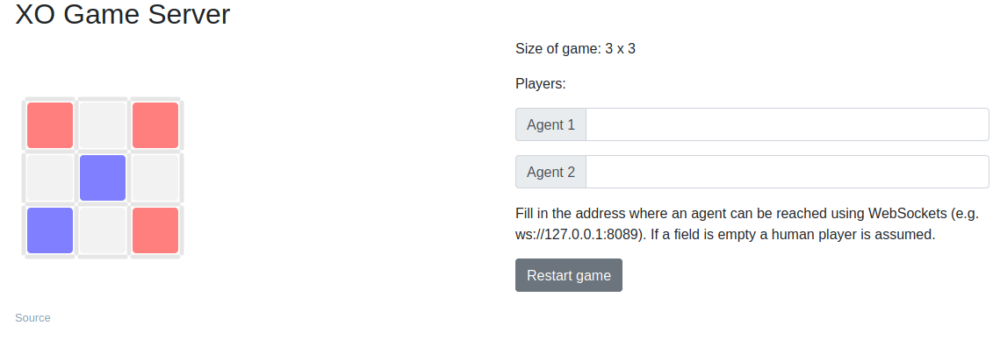

# XO (TicTacToe) Leaning Environment

A framework for testing reinforcement learning algorithms on the simple XO game. Designed for learning and testing reinforcement learning and tree search algorithms.

## TODO
- [x] Write xocompete.py for playing 2 agents against each other.
- [x] Write a random agent.
- [x] Write  a xoserver.py and a frontend for human player.
- [x] Write the DQN.
- [x] Add convolutional architecture in DQN.
- [x] Write MiniMax agent.
- [x] Write AlphaBeta search tree agent.
- [ ] Write Dueling DQN agent.
- [ ] Let Agents tell their names while playing.

## Details
Course project for EE782, IIT Bombay.

### Team Members
- Mohd Safwan
- Kumar Ashutosh
- Manas Vashistha
